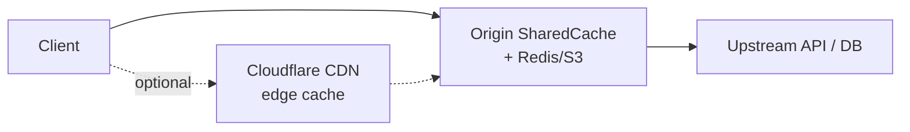

# Cloudflare Cache vs SharedCache

This guide compares [Cloudflare CDN Cache](https://developers.cloudflare.com/cache/) and the [Workers Cache API](https://developers.cloudflare.com/workers/runtime-apis/cache/) with `@web-widget/shared-cache`—how the public API maps to Cloudflare behavior and where they differ.

## Quick reference

| Capability | CF CDN | Workers Cache | SharedCache (public API) |
| ---------- | ------ | ------------- | ------------------------ |
| Custom query string | Ignore QS (all plans) / Cache Rules (Enterprise) | — (URL is the key; control at `put`) | `search` |
| Custom header / cookie | Cache Rules (Enterprise) | — | `header` / `cookie` |
| Device segmentation | device type (all plans) / Cache Rules User (Enterprise) | — | `device` |
| Geo / lang segmentation | Cache Rules User (Enterprise) | — | ❌ |
| Scheme / pathname | Implicit in URL | Implicit in URL | `@internal` (runtime configurable) |
| Host | Cache Rules Host header policy (Enterprise) | Implicit in URL | `@internal` (`url.host` segment, not Host header) |
| Cache status header | `CF-Cache-Status` | — | `x-cache-status` (`createFetch`, etc.) |
| `stale-while-revalidate` | ✅ (`UPDATING`, etc.) | ❌ (`put`/`match` unsupported) | ✅ (`UPDATING`; `createFetch` / `resolveWithCache`) |
| `stale-if-error` | ✅ (`STALE`, etc.) | ❌ | ✅ (`STALE`) |
| `match({ ignoreMethod })` | — | ✅ | ✅ |
| Pluggable storage | Platform-managed | Built-in (not swappable) | ✅ `KVStorage` at origin (Redis, S3, etc.) |

## Cache Key

### Public configuration mapping

Cloudflare [Cache Rules cache key settings](https://developers.cloudflare.com/cache/how-to/cache-keys/) vs **public** `CacheKeyRules` fields:

| Cloudflare Cache Rules | SharedCache (public) | Alignment |
| ---------------------- | -------------------- | --------- |
| Query String | `search` | ✅ `include` / `exclude` / `checkPresence`; `search: false` ≈ ignore query string |
| Headers | `header` | ✅ include/exclude/check presence by name; restricted by `CANNOT_INCLUDE_HEADERS` |
| Cookie | `cookie` | ✅ include/exclude/check presence by name |
| Host | — | ⚠️ CF uses Host *header* policy; our `host` controls the `url.host` segment (`@internal`) |
| User → `device_type` | `device` | ✅ `device: true` → mobile / desktop / tablet from UA |
| User → `geo` | — | ❌ not implemented |
| User → `lang` | — | ❌ not implemented |

Public type (`dist/shared-cache.d.ts`):

```typescript
interface CacheKeyRules {
  cookie?: KeyFilterOptions | boolean;
  device?: KeyFilterOptions | boolean;
  header?: KeyFilterOptions | boolean;
  search?: KeyFilterOptions | boolean;
}
```

### Default cache key composition

| Source | Default includes |
| ------ | ---------------- |
| Cloudflare default cache key | Full URL (scheme, host, URI with path and query string), Origin header, several `x-*` proxy headers |
| SharedCache default | `https://example.com/path?a=1` (`scheme` + `host` + `pathname` + `search` all `true`) |

SharedCache does **not** include the Origin header or Cloudflare’s default `x-forwarded-*` proxy headers. `cookie`, `device`, and `header` are off by default.

`DEFAULT_CACHE_KEY_RULES` still sets `scheme`, `host`, and `pathname` at runtime, but those fields are `@internal` in the public TypeScript types.

### Implicit URL parts (non-public)

| Field | Cloudflare | SharedCache |
| ----- | ---------- | ----------- |
| `scheme` | Part of default URL; no separate Cache Rule toggle | `@internal`, default `true`; `scheme: false` for reverse-proxy setups |
| `host` | Cache Rules Host header policy (Enterprise), not URL host | `@internal`, default `true`; `url.host` segment, not Host header |
| `pathname` | Part of URI; no separate toggle | `@internal`, default `true` |

### Restricted headers

Cloudflare disallows `cookie`, `host`, etc. in header cache key rules (handled by separate Cookie / Host features). `CANNOT_INCLUDE_HEADERS` follows the same idea and also excludes high-cardinality headers (`accept-*`, `user-agent`, etc.) and cache-related headers (`cache-control`, `if-*`, etc.).

### Cloudflare plan limits

Fine-grained cache key options below are **Enterprise** only on Cloudflare (Free / Pro / Business get ignore query string, sort query string, cache by device type, etc.):

- Query string (per-parameter include/exclude)
- Headers
- Cookie
- Host
- User features (geo, lang, …)

SharedCache has no plan tiers—all of the above are available in code.

## Cache Status

### Response headers

| | Cloudflare CDN | SharedCache |
|---|----------------|-------------|
| Header name | `CF-Cache-Status` | `x-cache-status` |
| Purpose | Edge cache diagnostics | Debugging and monitoring (non-standard; do not use in app logic) |
| When present | Responses proxied through Cloudflare | `createFetch` / `createCacheHandler` / `resolveWithCache`; bare `cache.match()` does not add it |

### Status values

See [Cloudflare cache responses](https://developers.cloudflare.com/cache/concepts/cache-responses/).

| Status | Cloudflare `CF-Cache-Status` | SharedCache `x-cache-status` | Notes |
| ------ | ---------------------------- | ---------------------------- | ----- |
| `HIT` | ✅ | ✅ | Served from cache |
| `MISS` | ✅ | ✅ | Not in cache; fetched from origin |
| `EXPIRED` | ✅ revalidate at origin, return fresh | ✅ synchronous revalidation | Similar semantics |
| `UPDATING` | ✅ stale served during async SWR | ✅ background revalidation | v1.9+ aligns with CF CDN; `STALE` reserved for `stale-if-error` |
| `STALE` | ✅ expired, origin unreachable | ✅ `stale-if-error` or revalidation failure | CF: origin down; SharedCache: error fallback |
| `BYPASS` | ✅ `no-cache` / `private` / `max-age=0`, etc. | ✅ same Cache-Control bypass | |
| `REVALIDATED` | ✅ sync conditional revalidation, 304 | ✅ sync revalidation success | Less common on CF after async SWR; still supported here |
| `DYNAMIC` | ✅ not cacheable | ✅ not cacheable (method, status, etc.) | |
| `NONE` / `UNKNOWN` | ✅ Worker / WAF / redirect, etc. | ❌ no equivalent | |

### `stale-while-revalidate` behavior

Cloudflare supports [async stale-while-revalidate](https://developers.cloudflare.com/changelog/post/2026-02-26-async-stale-while-revalidate/): after expiry, the first request gets `UPDATING` while revalidation runs in the background.

SharedCache’s `createFetch` path also returns `UPDATING`, but timing depends on the storage backend and `event.waitUntil()`—it need not match global CDN edge behavior exactly.

### Workers Cache API and `stale-*`

Workers `cache.put()` / `cache.match()` do **not** support `stale-while-revalidate` or `stale-if-error` ([Workers Cache docs](https://developers.cloudflare.com/workers/runtime-apis/cache/)). SharedCache implements full RFC 5861 semantics in `createFetch`—an extension beyond the bare Workers Cache API.

## Workers Cache API subset

`Cache.match()` / `Cache.delete()` align with this [Workers Cache API](https://developers.cloudflare.com/workers/runtime-apis/cache/) subset:

### `match()` / `delete()` options

| Option | Workers Cache API | SharedCache |
| ------ | ----------------- | ----------- |
| `ignoreMethod` | ✅ | ✅ |
| `ignoreSearch` | ❌ | ❌ throws; use `cacheKeyRules.search: false` |
| `ignoreVary` | ❌ | ❌ throws; use `sharedCache.ignoreVary: true` |

### Conditional requests (`If-None-Match` / `If-Modified-Since`)

| | Workers Cache API | SharedCache |
|---|-------------------|-------------|
| `match()` when condition holds | Returns `304 Not Modified` | ✅ same |
| Revalidation | No subrequest to origin (`undefined` on miss) | `createFetch` revalidates with origin |

### `put()` limits (shared)

- Only `GET` requests as keys (non-GET needs `ignoreMethod`)
- Responses with `Set-Cookie` are not cached by default
- `Vary: *` cannot be cached
- Workers: `stale-while-revalidate` / `stale-if-error` ineffective on `put`/`match`

### Unimplemented Web Cache API methods

`add()`, `addAll()`, `keys()`, and `matchAll()` throw—not needed in typical server environments.

## Vary

| | Cloudflare | SharedCache |
|---|------------|-------------|
| Default | CDN shards cache by `Vary` | `Vary` processed by default; extra storage lookups possible |
| Disable | No direct equivalent | `sharedCache.ignoreVary: true` |
| Override | Cache Rules, etc. | `sharedCache.varyOverride` |

## Debug headers

| | Cloudflare | SharedCache |
|---|------------|-------------|
| Cache key debug | [Cloudflare Trace](https://developers.cloudflare.com/rules/trace-request/) | `sharedCache.debugCacheKey: true` → `x-cache-key` |
| Key encoding | — | Non-ASCII / control chars percent-encoded for valid HTTP headers |

## Storage

SharedCache is **origin-side** HTTP caching (application servers), not Cloudflare’s global edge cache. It intercepts requests before business logic or upstream APIs and reuses cached responses to cut load and latency.

Typical deployments share **Redis** across instances, or use **S3** (or similar) for larger, colder entries. Backends plug in via `KVStorage`; the library does not ship a specific store.

### Architecture



Optional: global PoP HIT returns at the edge · Origin HIT returns from SharedCache; on MISS, continue downstream.

| | Cloudflare CDN / Workers Cache | SharedCache |
|---|-------------------------------|-------------|
| Cache location | Cloudflare edge PoPs | KV store reachable from origin processes |
| Storage | Platform-managed, not pluggable | Pluggable `KVStorage` (Redis, S3, memory, …) |
| Multi-instance sharing | CDN shares globally | Requires shared backend (e.g. Redis) |
| Data residency | Workers Cache does not replicate out of originating DC | Depends on store (Redis region, S3 bucket, …) |
| Primary use | Static assets, HTML, API edge acceleration | Node.js server, `createFetch` outbound cache, middleware cache |

Layers stack optionally: Cloudflare CDN can sit in front; SharedCache always runs at the origin. Without CDN, clients connect to the origin directly.

The library does not bundle Redis or S3 clients—only the contract. Encryption, compression, and sharding can wrap `KVStorage` (see encrypted storage example in the README).

### Namespaces and multi-tenancy

`CacheStorage` partitions logical caches by name on one `KVStorage`:

```typescript
const caches = new CacheStorage(redisStorage);
const apiCache = await caches.open('api-v1');
const pageCache = await caches.open('pages');
```

`_cacheName` prefixes physical keys to avoid collisions between `open()` names.

### Storage notes tied to cache behavior

- **Vary**: with default processing, one lookup may do **two** `get` calls (base key + Vary metadata). Remote Redis amplifies cost; `ignoreVary: true` reduces to one query.
- **Workers Cache API**: Workers use `caches.default` or `caches.open()` with non-replaceable storage; SharedCache’s `Cache` / `CacheStorage` shape is similar but must sit on your own `KVStorage`.
- **Expiry**: `cache.match()` returns `undefined` for expired entries; `createFetch` adds revalidation, `stale-while-revalidate`, and `x-cache-status`.

## References

- [Cloudflare Cache Keys](https://developers.cloudflare.com/cache/how-to/cache-keys/)
- [Cloudflare Cache Responses (`CF-Cache-Status`)](https://developers.cloudflare.com/cache/concepts/cache-responses/)
- [Cloudflare Workers Cache API](https://developers.cloudflare.com/workers/runtime-apis/cache/)
- [Cloudflare async stale-while-revalidate changelog](https://developers.cloudflare.com/changelog/post/2026-02-26-async-stale-while-revalidate/)
